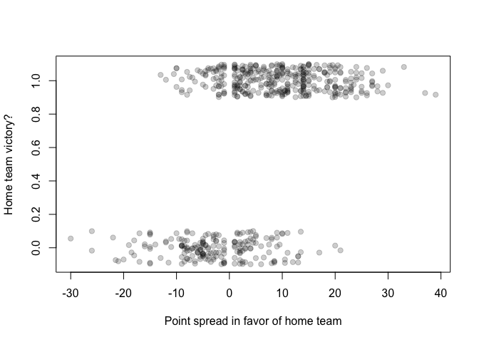
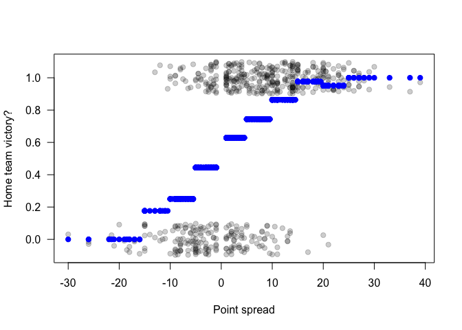
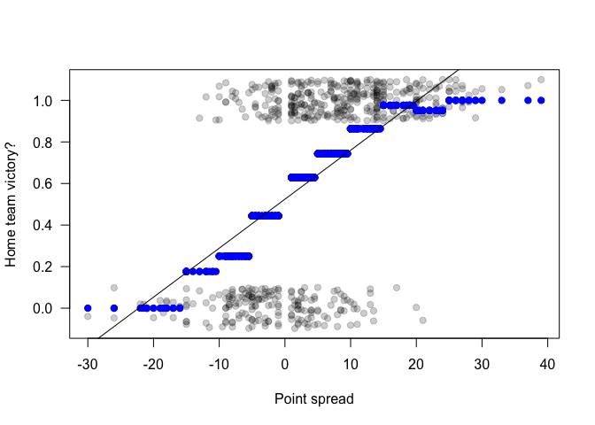
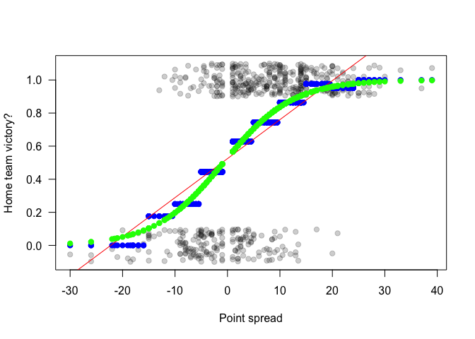
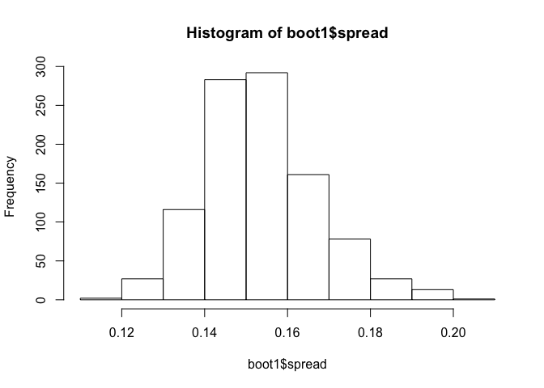

### Logistic regression

In this walk-through, you'll learn about the logistic regression model.
Key ideas:  
\* Fit a linear probability model and recognize its shortcomings \*
Compute standard errors under a logistic-regression model

Data files:  
\* [bballbets.csv](bballbets.csv): Data on college basketball games.
Each row is a game. The variable we'd like to predict is `homewin`,
which is an indicator for whether the home team won the game (1) or lost
the game (0). Our predictor is `spread`, which is the Las Vegas [point
spread](http://en.wikipedia.org/wiki/Spread_betting) in favor of the
home team for that game. For example, if the point spread is 10, then
the betting markets collectively expect that the home team will win by
10 points.

First we'll load the required libraries and data set.

    ## Loading required package: car
    ## Loading required package: dplyr
    ## 
    ## Attaching package: 'dplyr'
    ## 
    ## The following object is masked from 'package:stats':
    ## 
    ##     filter
    ## 
    ## The following objects are masked from 'package:base':
    ## 
    ##     intersect, setdiff, setequal, union
    ## 
    ## Loading required package: lattice
    ## Loading required package: ggplot2
    ## 
    ## Attaching package: 'mosaic'
    ## 
    ## The following objects are masked from 'package:dplyr':
    ## 
    ##     count, do, tally
    ## 
    ## The following object is masked from 'package:car':
    ## 
    ##     logit
    ## 
    ## The following objects are masked from 'package:stats':
    ## 
    ##     binom.test, cor, cov, D, fivenum, IQR, median, prop.test,
    ##     quantile, sd, t.test, var
    ## 
    ## The following objects are masked from 'package:base':
    ## 
    ##     max, mean, min, prod, range, sample, sum

Let's plot the outcome (homewin) versus the point spread. Note that,
because the homewin variable is either 0 or 1, it is hard to distinguish
the individual points.

    plot(homewin ~ spread, data=bballbets)

One simple way around this is to add some artificial jitter to the
points, strictly for the sake of visualizing them:

    plot(jitter(homewin, 0.5) ~ spread, data=bballbets,
      ylab='Home team victory?', xlab='Point spread in favor of home team',
        pch=19, col=rgb(0,0,0,0.2))

The points have been jittered up or down enough to distinguish them, but
not so much that we can no longer tell which are 0 and which are 1.
Clearly the home team wins more often when there is a big point spread
in its favor (and vice versa for the visiting team).

### Calculating empirical frequencies

Our goal is to fit a model that describes how likely the home team is to
win, given the Las Vegas point spread. Here's an especially simple way
to proceed: divide the `spread` variable into categories (i.e.
discretize it) and compute the fraction of home team wins in each
category. We'll use the \`cut' function to divide the point spread at
intervals of 5 points:

    cut_points = seq(-30, 40, by=5)
    spread_category = cut(bballbets$spread, cut_points, right=FALSE)
    summary(spread_category)

    ## [-30,-25) [-25,-20) [-20,-15) [-15,-10)  [-10,-5)    [-5,0)     [0,5) 
    ##         3         3         9        17        56        90       105 
    ##    [5,10)   [10,15)   [15,20)   [20,25)   [25,30)   [30,35)   [35,40) 
    ##        78        88        42        41        17         2         2

Notice that the intervals are closed on the left and open on the right
(because we specified `right=FALSE` to the cut function). Now let's use
this categorical variable we've created to calculate the empirical
frequency of home-team victories within each bucket:

    homewin_frequency = mean(homewin ~ spread_category, data=bballbets)
    homewin_frequency

    ## [-30,-25) [-25,-20) [-20,-15) [-15,-10)  [-10,-5)    [-5,0)     [0,5) 
    ## 0.0000000 0.0000000 0.0000000 0.1764706 0.2500000 0.4444444 0.6285714 
    ##    [5,10)   [10,15)   [15,20)   [20,25)   [25,30)   [30,35)   [35,40) 
    ## 0.7435897 0.8636364 0.9761905 0.9512195 1.0000000 1.0000000 1.0000000

We can plot the fitted values from this group-wise model as follows:

    lm0 = lm(homewin ~ spread_category, data=bballbets)
    plot(jitter(homewin,0.5) ~ spread, data=bballbets,
      ylab='Home team victory?', xlab='Point spread',
      pch=19, col=rgb(0,0,0,0.2), las=1)
    points(fitted(lm0) ~ spread, data=bballbets, col='blue', pch=19)

### The linear probability model

The strategy of discretizing the point-spread variable certainly conveys
some interesting information, but it's unsatisfying in one important
way: it doesn't allow the probability of a home-team win to vary
continuously with the point spread. It treats a point spread of +1
exactly the same as a point spread of +9, which we know can't be right.

We could, of course, discretize the point-spread variable more finely,
say into 1-point increments. But then we'd have very few games falling
into each bucket, and our estimate of the empirical win frequency within
each bucket would be very noisy. If you're sharp-eyed, you'll notice
from the plot above that this is already a problem even with five-point
intervals: the interval [20,24) has a lower empirical win frequency than
the interval [15,20), which presumably happened only because of the
noise induced by small sample sizes within those intervals.

One alternative approach is called the "linear probability model," in
which we fit a linear model for the 0/1 outcome using least squares:

    lm1 = lm(homewin~spread, data=bballbets)
    plot(jitter(homewin,0.5) ~ spread, data=bballbets,
      ylab='Home team victory?', xlab='Point spread',
        pch=19, col=rgb(0,0,0,0.2), las=1)
    points(fitted(lm0) ~ spread, data=bballbets, col='blue', pch=19)
    abline(lm1)

We can interpret the line as the estimated conditional probability of a
home-team win, given the Las Vegas point spread.

### Binomial logistic regression

One problem with the straight-line model is that, while it fits the
empirical-win frequencies reasonably well towards the middle, it fails
badly for extreme values of the point spread. Notice that the empirical
frequencies form something of a foreshortened S shape, and never fall
outside the allowed interval [0,1]. By definition, this is impossible to
model with a straight line.

A simple fix is to fit a binomial logistic regression model (or a logit
model, for short) instead:

    glm1 = glm(homewin~spread, data=bballbets, family=binomial)
    plot(jitter(homewin,0.5) ~ spread, data=bballbets,
      ylab='Home team victory?', xlab='Point spread',
      pch=19, col=rgb(0,0,0,0.2), las=1)
    points(fitted(lm0) ~ spread, data=bballbets, col='blue', pch=19)
    abline(lm1, col='red')
    # Now add the fitted vaues from the logit model
    points(fitted(glm1)~spread,data=bballbets, col='green', pch=19)

The fitted values from the logit model respect the restriction that
probabilities must be between 0 and 1. They also fit the empirical win
frequencies (in blue) much better.

### Quantifying uncertainty in logit models

The coefficients of the logit model can be accessed in the same way as
for a linear model:

    coef(glm1)

    ## (Intercept)      spread 
    ##   0.1171765   0.1519448

If we want to compute confidence intervals or standard errors, we know
of at least two options. First, we can bootstrap:

    boot1 = do(1000)*{
      glm1 = glm(homewin~spread, data=resample(bballbets), family=binomial)
      coef(glm1)
    }
    hist(boot1$spread)

    confint(boot1)

    ##        name      lower     upper level method  estimate margin.of.error
    ## 1 Intercept -0.1037572 0.3434380  0.95 stderr 0.1198404      0.22359758
    ## 2    spread  0.1280985 0.1792418  0.95 stderr 0.1536702      0.02557166

We can also appeal to R's summary function, which computes confidence
intervals under a normal approximation to the coefficients arising from
the central limit theorem:

    confint(glm1)

    ## Waiting for profiling to be done...

    ##                  2.5 %    97.5 %
    ## (Intercept) -0.1575926 0.2878971
    ## spread       0.1353938 0.1935399

In this case, the confidence intervals are similar for the two
techniques.
