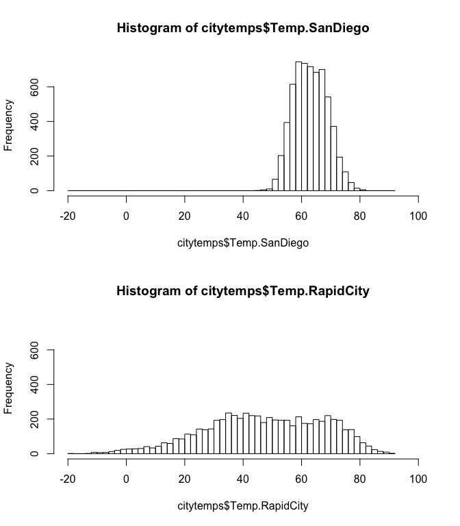
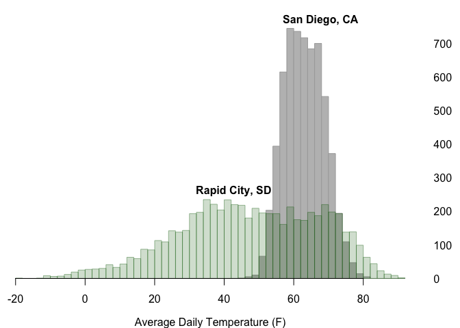

### Measuring and visualizing dispersion

In this walk-through, you'll learn how to measure and visualize
dispersion of a single quantitative variable. You will also learn how to
change some of the default graphics settings in R plots.

Data files:  
\* [citytemps.csv](citytemps.csv): daily average temperatures in San
Diego, CA and Rapid City, SD.

First download the citytemps.csv file and read it in. You can use
RStudio's Import Dataset button, or use the read.csv command:

    citytemps = read.csv('citytemps.csv')

If you do this second option, make sure you're working from the
directory where the data lives, or put the full path to the file between
the quotation marks.

We'll start off by getting R to summarize the variables:

    summary(citytemps)

    ##       Year          Month             Day        Temp.SanDiego  
    ##  Min.   :1995   Min.   : 1.000   Min.   : 1.00   Min.   :45.10  
    ##  1st Qu.:1999   1st Qu.: 4.000   1st Qu.: 8.00   1st Qu.:58.70  
    ##  Median :2003   Median : 7.000   Median :16.00   Median :63.00  
    ##  Mean   :2003   Mean   : 6.492   Mean   :15.71   Mean   :63.08  
    ##  3rd Qu.:2007   3rd Qu.: 9.000   3rd Qu.:23.00   3rd Qu.:67.30  
    ##  Max.   :2011   Max.   :12.000   Max.   :31.00   Max.   :81.30  
    ##  Temp.RapidCity  
    ##  Min.   :-19.00  
    ##  1st Qu.: 33.30  
    ##  Median : 47.60  
    ##  Mean   : 47.28  
    ##  3rd Qu.: 63.95  
    ##  Max.   : 91.90

You can see we have 17 years of temperature data on San Diego and Rapid
City. Let's focus on San Diego. We'll start with a histogram, one of the
most basic plots for a single quantitative variable:

    hist(citytemps$Temp.SanDiego)

You already know one way of summarizing the dispersion of this
distribution: the standard deviation.

    mean(citytemps$Temp.SanDiego)

    ## [1] 63.08156

    sd(citytemps$Temp.SanDiego)

    ## [1] 5.698457

Another measure of dispersion is the coverage interval: that is, an
interval covering a specified fraction of the observations. For example,
to get a central 50% coverage interval, we'd need the 25th and 75
percentiles of the distribution. By definition, 50% of the observations
are between these two numbers. You can get these from the quantile
function.

    quantile(citytemps$Temp.SanDiego)

    ##   0%  25%  50%  75% 100% 
    ## 45.1 58.7 63.0 67.3 81.3

You can also ask for different quantiles by passing a second argument
called "probs," like this:

    quantile(citytemps$Temp.SanDiego, probs=c(0.05, 0.95))

    ##   5%  95% 
    ## 54.2 72.6

In computer science an "argument" is just something we pass to a
function. In this case, `probs=c(0.05, 0.95)` is an optional argument
that modifies the default behavior of the quantile function to yield the
5th and 95th percentiles. We could use these numbers to construct a 90%
coverage interval.

### Changing the default look of plots

Next, we'll make a histogram for Rapid City, except we'll change the
default title and x-axis label to something a bit more fit for human
consumption.

    hist(citytemps$Temp.RapidCity, main="Average Daily Temperatures in Rapid City, 1995-2011", xlab='Temperature')

Notice again that we've used optional arguments (main and xlab) to
change the main title and x-axis label, respectively.

Next, let's stack the two histograms on top of each other, to make a
multi-frame plot. We do this with the following code block. The first
line says to make a multi-frame plot (filled in along the rows) with 2
rows and 1 column. The next two plotting commands then fill in the two
frames.

    par(mfrow=c(2,1))
    hist(citytemps$Temp.SanDiego)
    hist(citytemps$Temp.RapidCity)

This won't do at all: notice that the axes and bin sizes differ between
the two plots. This makes it hard to compare the two distributions at a
glance. We need to align these two plots to have the same axes and bins.
Just as we did above, we'll do this by passing additional arguments to
the `hist` function.

First, we must define a set of breakpoints for the histogram grams.
We'll do this with the `seq` (which stands for sequence) command:

    mybreaks = seq(-20, 92, by=2)

This says to make a sequence running from -20 to 92 degrees in
increments of 2. You'll see the whole sequence if you type `mybreaks`
directly into the console"

    mybreaks

    ##  [1] -20 -18 -16 -14 -12 -10  -8  -6  -4  -2   0   2   4   6   8  10  12
    ## [18]  14  16  18  20  22  24  26  28  30  32  34  36  38  40  42  44  46
    ## [35]  48  50  52  54  56  58  60  62  64  66  68  70  72  74  76  78  80
    ## [52]  82  84  86  88  90  92

Now we can make the histograms using these custom bins. We'll also
change the x and y axes using the xlim and ylim arguments:

    par(mfrow=c(2,1))
    hist(citytemps$Temp.SanDiego, breaks=mybreaks, xlim=c(-20,100), ylim=c(0, 760))
    hist(citytemps$Temp.RapidCity, breaks=mybreaks, xlim=c(-20,100), ylim=c(0, 760))

Now the bins and axes are comparable, making the distributions
themselves much easier to compare.

### Optional

Below, I've included a set of commands that produce a much prettier
plot. Feel free to go line by line and modify these commands to see what
behavior they produce. You can learn a lot about R this way:

    mybreaks = seq(-20, 92, by=2)
    par(mfrow=c(1,1), mar=c(3,0,1,3), mgp=c(2,1,0))
    hist(citytemps$Temp.SanDiego, breaks=mybreaks, xlab="Average Daily Temperature (F)", main="", border="darkgrey", col="grey", axes=FALSE, ylim=c(0, 760))
    hist(citytemps$Temp.RapidCity,breaks=mybreaks,add=TRUE, border=rgb(0,100,0,100,maxColorValue=255), col= rgb(0,100,0,50,maxColorValue=255))
    axis(4,at=seq(0,700,by=100), las=1,tick=FALSE)
    axis(1,pos=0)
    text(55, 770, "San Diego, CA", pos=4, font=2)
    text(30, 260, "Rapid City, SD", pos=4, font=2)

