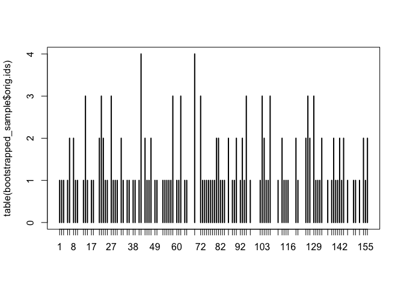
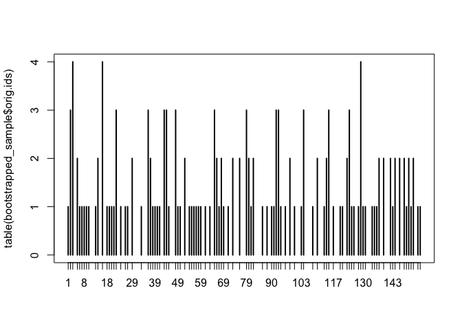
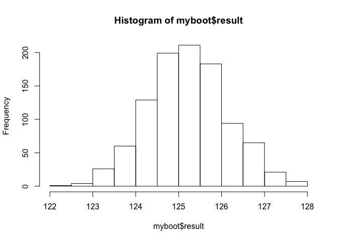
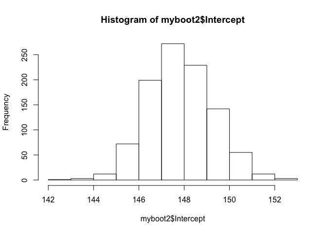
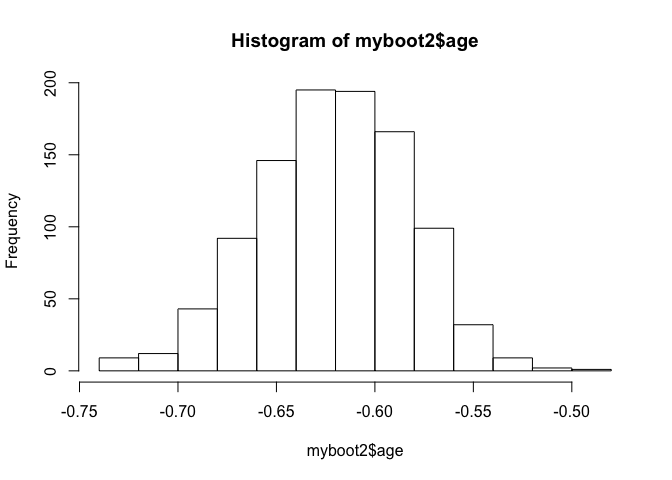
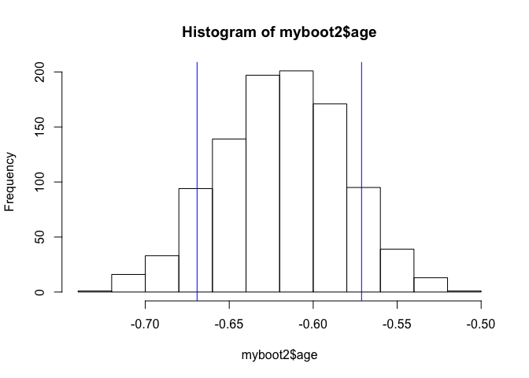

Approximating the sampling distribution by bootstrapping
--------------------------------------------------------

Learning goals:  
\* bootstrap the sample mean  
\* bootstrap the OLS estimator  
\* compute and interpret the bootstrapped standard error

Data files:  
\* [creatinine.csv](creatinine.csv): data on age and kidney function for
157 adult males from a single clinic.

Load the mosaic library and then return to the creatinine data set,
which we recall had data on the age and kidney function for a sample of
men from a single clinic.

    library(mosaic)

    creatinine = read.csv('creatinine.csv', header=TRUE)
    summary(creatinine)

    ##       age          creatclear   
    ##  Min.   :18.00   Min.   : 89.3  
    ##  1st Qu.:25.00   1st Qu.:118.6  
    ##  Median :31.00   Median :128.0  
    ##  Mean   :36.39   Mean   :125.3  
    ##  3rd Qu.:43.00   3rd Qu.:133.3  
    ##  Max.   :88.00   Max.   :147.6

The two variables are  
\* age: the patient's age.  
\* creatclear: the patient's creatinine-clearance rate, measured in
ml/minute.

### Bootstrapped samples

We will start by addressing the following question. What can we say
about the average creatinine-clearance rate for the population of men
who attend this clinic, on the basis of this particular sample of 157?
The sample mean is easy enough to compute:

    creatclear_samplemean = mean(creatinine$creatclear)
    creatclear_samplemean

    ## [1] 125.2548

But we know that our sample mean of 125 won't exactly equal the
population mean. To quantify how far off our estimate is likely to be,
we would like to know the standard error of the sample mean. Moreover,
we'd like to know this without taking many more samples of 157 from the
population and seeing how the sample mean changes from one sample to the
next.

The idea of the bootstrap is to pretend that your sample represents the
whole population. We then take repeated "bootstrapped" samples from the
original sample. Each bootstrapped sample is defined by two
properties:  
1) It has the same size as the original sample.  
2) It is a sample with replacement from the original sample. Because we
sample with replacement, it is inevitable that our bootstrapped sample
will contain ties and omissions. That is, some points from the original
sample will get picked more than once, and some won't get picked at all.
This approximates the process of taking repeated real samples from the
whole population.

Let's see this in action. First, let's create a bootstrapped sample and
look at the first 20 data points. We'll do this using the `sample`
command.

    bootstrapped_sample = sample(creatinine, size = 157, replace=TRUE)
    head(bootstrapped_sample, 20)

    ##      age creatclear orig.ids
    ## 18    34      128.6       18
    ## 109   31      123.1      109
    ## 31    32      117.5       31
    ## 73    65       89.3       73
    ## 40    25      132.9       40
    ## 112   27      141.2      112
    ## 49    24      129.0       49
    ## 68    28      123.7       68
    ## 25    28      126.8       25
    ## 33    25      127.7       33
    ## 64    63      114.6       64
    ## 155   69      110.9      155
    ## 62    30      124.4       62
    ## 143   41      119.1      143
    ## 63    33      126.5       63
    ## 39    32      132.7       39
    ## 142   80      113.3      142
    ## 14    55      114.0       14
    ## 62.1  30      124.4       62
    ## 71    54      125.9       71

If you look carefully, you may see a repeated entry in these first 20
rows. That's because our bootstrapped sample is a sample with
replacement from the original sample. You can visualize the pattern of
ties and omissions with the following plot:

    plot(table(bootstrapped_sample$orig.ids))

The height of each bar shows how many times that original data point was
picked. The gaps show data points that were omitted.

There's actually a more concise way to draw bootstrapped samples using
the `resample` command, which we'll use from now on. Try executing the
following block of code 5 or 10 times to get a feel for the different
patterns of ties and omissions that arise in each bootstrapped sample.

    bootstrapped_sample = resample(creatinine)  # same as sample(creatinine, size = 157, replace=TRUE)
    plot(table(bootstrapped_sample$orig.ids))

### Bootstrapping the sample mean

We're now ready to estimate the sampling distribution of the sample mean
by bootstrapping. Our basic procedure is:  
1) Take a bootstrap sample from the original sample.  
2) For this bootstrapped sample, we compute the sample mean of the
creatinine-clearance rate.

We repeat this process a large number of times (say, 1000 or more). The
key point is that, because each bootstrapped sample has a unique pattern
of ties and omissions, each will have a different sample mean. The
histogram of sample means across the bootstrapped samples then gives us
an idea of how the sample mean changes from sample to sample.

Try executing the following block of code 5-10 times to see the
different sample means you get for each bootstrapped sample.

    bootstrapped_sample = resample(creatinine)  # same as sample(creatinine, size = 157, replace=TRUE)
    mean(bootstrapped_sample$creatclear)

    ## [1] 125.6669

The final trick is to use the `do` command to automatic the process of
taking repeated bootstrapped samples and computing the sample mean for
each one.

    do(10)*{
      bootstrapped_sample = resample(creatinine)  # same as sample(creatinine, size = 157, replace=TRUE)
      mean(bootstrapped_sample$creatclear)
    }

    ##      result
    ## 1  124.2752
    ## 2  127.4242
    ## 3  125.8299
    ## 4  123.9924
    ## 5  126.8631
    ## 6  126.2904
    ## 7  125.0115
    ## 8  124.7197
    ## 9  125.7344
    ## 10 126.0331

If this looks unfamiliar, try revisiting the ["Gone
fishing"](http://jgscott.github.io/teaching/r/gonefishing/gonefishing.html)
walkthrough to remind yourself of the logic of the `do(10)*` command.

Now we're ready. Let's take 1000 bootstrapped samples, compute the
sample mean for each one and visualize the results.

    # Take bootstrapped samples
    myboot = do(1000)*{
      bootstrapped_sample = resample(creatinine)  # same as sample(creatinine, size = 157, replace=TRUE)
      mean(bootstrapped_sample$creatclear)
    }
    # Visualize the sampling distribution and compute the bootstrapped standard error
    hist(myboot$result)

    sd(myboot$result)

    ## [1] 0.9261576

Because we have different bootstrapped samples, your histogram and
estimated standard error will look slightly different from mine. But
they should be relatively close.

Incidentally, if you repeatedly execute the above code block, you'll get
slightly different histograms and standard errors each time. We refer to
this variability as "Monte Carlo error," to distinguish it from the
standard error of the estimator itself. In principle, you can drive the
Monte Carlo error to virtually nothing by taking a very large number of
bootstrapped samples.

### Bootstrapping the OLS estimator

Once you get the hang of bootstrapping the sample mean, you can
bootstrap just about anything. As a specific example, we will
approximate the sampling distribution of the least-squares estimator for
the relationship between creatinine clearance rate and age:

    # Plot the data
    plot(creatclear~age, data=creatinine)
    # Fit a straight line to the data by least squares
    lm1 = lm(creatclear~age, data=creatinine)
    # Extract the coefficients and plot the line
    coef(lm1)

    ## (Intercept)         age 
    ## 147.8129158  -0.6198159

    abline(lm1)

Let's warm-up by computing the OLS estimator for a single bootstrapped
sample. Try executing this code block 5-10 different times:

    lm_boot = lm(creatclear~age, data=resample(creatinine))
    lm_boot

    ## 
    ## Call:
    ## lm(formula = creatclear ~ age, data = resample(creatinine))
    ## 
    ## Coefficients:
    ## (Intercept)          age  
    ##    146.6244      -0.5985

Notice how the slope and intercept of the fitted line change for each
sample.

To get a good idea of the sampling distribution for these quantities, we
want to repeat this many more than 5-10 times. Let's now use the `do`
command to automate the whole process and save the result.

    myboot2 = do(1000)*{
      lm_boot = lm(creatclear~age, data=resample(creatinine))
      lm_boot
    }
    head(myboot2)

    ##   Intercept        age    sigma r.squared        F
    ## 1  147.7636 -0.6157572 6.627940 0.5875267 220.7819
    ## 2  148.0058 -0.6263379 6.661032 0.7010043 363.4021
    ## 3  146.1444 -0.5816035 7.182106 0.6332083 267.5831
    ## 4  149.4105 -0.6647822 7.771923 0.6819061 332.2775
    ## 5  147.8890 -0.6209656 6.998416 0.6708545 315.9164
    ## 6  149.3222 -0.6488174 6.953649 0.7078235 375.5013

Notice that we have separate columns for the intercept, slope on the age
variable, sigma (the residual standard deviation), and R-squared. (Don't
worry about the "F" column for now.) Let's visualize the sampling
distributions for the intercept and slope.

    hist(myboot2$Intercept)

    sd(myboot2$Intercept)

    ## [1] 1.435418

    hist(myboot2$age)

    sd(myboot2$age)

    ## [1] 0.03821251

### Confidence intervals

We've met coverage intervals before. A coverage interval is an interval
that covers a specified percentage (say 80% or 95%) of a distribution.

A confidence interval for a parameter is nothing but a coverage interval
for that parameter's sampling distribution. For example, let's look more
closely at the sampling distribution for the slope on the `age` variable
that we just approximated by bootstrapping. We'll plot the histogram,
compute the endpoints of an 80% coverage interval, and show these
endpoints on the plot.

    hist(myboot2$age)
    myinterval = quantile(myboot2$age, probs=c(0.1, 0.9))
    abline(v = myinterval, col='blue')

    myinterval

    ##        10%        90% 
    ## -0.6711636 -0.5737321

We would refer to this interval as an 80% confidence interval for the
slope of the age variable in our regression model. (As above, your
numbers won't match mine exactly because of the randomness inherent to
bootstrapping. But they should be close.) Note that this confidence
interval is very different from an 80% coverage interval of the actual
ages in the underlying sample:

    quantile(creatinine$age, probs=c(0.1, 0.9))

    ## 10% 90% 
    ##  23  62

You can use the `confint` command to quickly get confidence intervals
for all model parameters:

    confint(myboot2, level=0.8)

    ##        name       lower       upper level method    estimate
    ## 1 Intercept 145.9965734 149.6756982   0.8 stderr 147.8361358
    ## 2       age  -0.6697650  -0.5718224   0.8 stderr  -0.6207937
    ## 3     sigma   6.3416611   7.3618369   0.8 stderr   6.8517490
    ## 4 r.squared   0.6174491   0.7258576   0.8 stderr   0.6716534
    ## 5         F 246.7638591 402.7980149   0.8 stderr 324.7809370
    ##   margin.of.error
    ## 1      1.83956239
    ## 2      0.04897131
    ## 3      0.51008791
    ## 4      0.05420430
    ## 5     78.01707788

You will notice that this gives a slightly different answer to the
confidence interval we calculated from the quantiles, above. That's
because the default behavior of the \`confint' function is to give a
confidence interval that is symmetric about the sample mean. That is, we
take the mean of the histogram and step out symmetrically to either side
until we cover 80% of the sampling distribution; we call this a
"central" confindence interval. The 80% interval we computed above, on
the other hand, contained exactly 10% of the bootstrapped samples in
each tail of the histogram; we call this an "equal-tail" confidence
interval. Neither is better than the other; they are simply different
conventions. In the special case where the underlying sampling
distribution is exactly symmetric, then the two conventions will give
the same answer.
