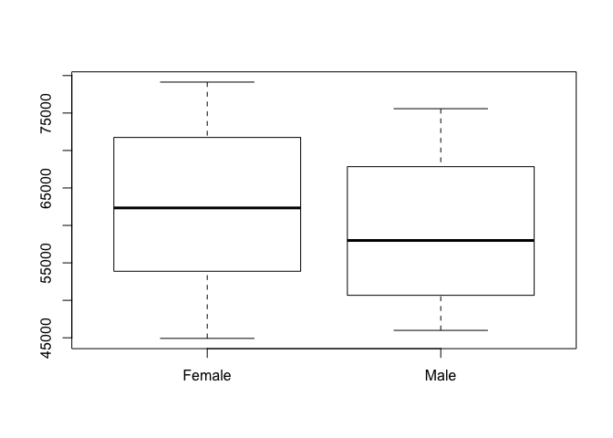
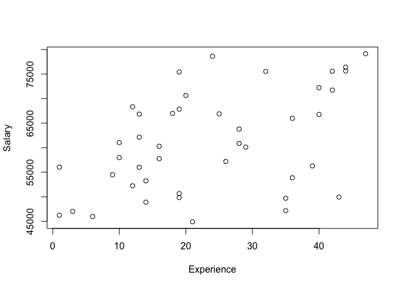
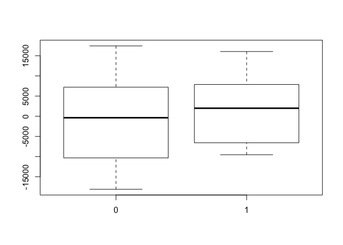
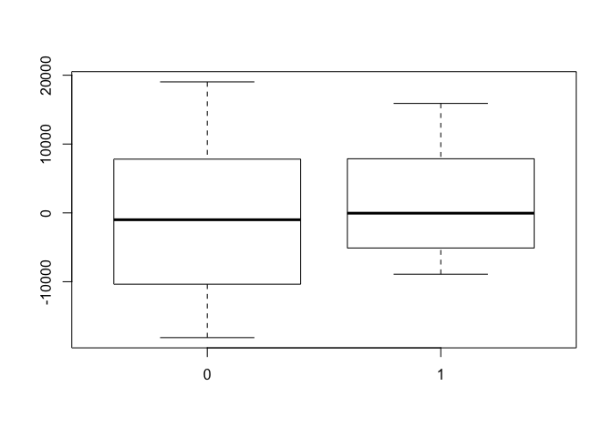
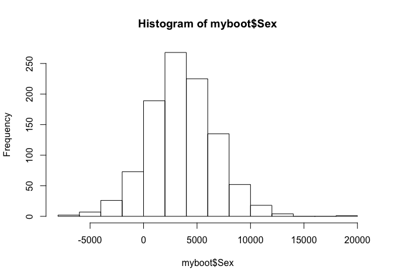

### Example: predictors of white-collar salaries

In this walk-through, we'll look at whether there seems to be a "wage
gap" at a tech firm between male and female employees with similar
qualifications. We will use multiple regression to adjust for the effect
of education and experience in evaluating the correlation between an
employee's sex and his or her annual salary.

Learning goals:  
\* fit a multiple regression model  
\* correctly interpret the estimated coefficients  
\* quantify uncertainty about parameters in a multiple-regression model
using both normal-theory formulas and bootstrapping

Data files:  
\* [salary.csv](salary.csv): human-resources data on employees at a tech
firm.

First load the mosaic library and read in the data.

    library(mosaic)

    salary = read.csv('salary.csv', header=TRUE)

The variables in the data set are:  
\* Salary: annual salary in dollars  
\* Education: years of post-second education  
\* Experience: months of experience at the particular company  
\* Months: total months of work experience, including all previous
jobs  
\* Sex: whether the employee is male or female

Let's first Look at the distibution of salary by sex.

    mean(Salary~Sex,data=salary)

    ##        0        1 
    ## 62610.45 59381.90

    boxplot(Salary~Sex,data=salary, names=c("Female", "Male"))

It looks as though women are paid more at this company than men, on
average. However, does the story change if we adjust for work
experience?

    plot(Salary~Experience, data=salary)

    lm1 = lm(Salary~Experience, data=salary)
    summary(lm1)

    ## 
    ## Call:
    ## lm(formula = Salary ~ Experience, data = salary)
    ## 
    ## Residuals:
    ##      Min       1Q   Median       3Q      Max 
    ## -18112.6  -6604.7    458.1   7542.4  17436.5 
    ## 
    ## Coefficients:
    ##             Estimate Std. Error t value Pr(>|t|)    
    ## (Intercept)  52516.7     2880.4  18.232  < 2e-16 ***
    ## Experience     361.5      107.0   3.379  0.00161 ** 
    ## ---
    ## Signif. codes:  0 '***' 0.001 '**' 0.01 '*' 0.05 '.' 0.1 ' ' 1
    ## 
    ## Residual standard error: 9143 on 41 degrees of freedom
    ## Multiple R-squared:  0.2178, Adjusted R-squared:  0.1988 
    ## F-statistic: 11.42 on 1 and 41 DF,  p-value: 0.001605

We expect experienced workers to be paid more, all else being equal. How
do these residuals---that is, salary adjusted for experience---look when
we stratify them by sex?

    boxplot(resid(lm1)~salary$Sex)

### Fitting a multiple regression model by least squares

Now it looks like men are being paid more than women for an equivalent
amount of work experience. What about a multiple-regression model that
accounts for education, too? It is straightforward to fit such a model
by least squares in R.

    lm2 = lm(Salary~Experience+Education, data=salary)
    summary(lm2)

    ## 
    ## Call:
    ## lm(formula = Salary ~ Experience + Education, data = salary)
    ## 
    ## Residuals:
    ##      Min       1Q   Median       3Q      Max 
    ## -18124.1  -5134.0   -692.4   7833.8  19029.2 
    ## 
    ## Coefficients:
    ##             Estimate Std. Error t value Pr(>|t|)    
    ## (Intercept)  45928.4     6195.1   7.414 5.01e-09 ***
    ## Experience     356.0      106.5   3.342  0.00181 ** 
    ## Education     1709.5     1425.3   1.199  0.23741    
    ## ---
    ## Signif. codes:  0 '***' 0.001 '**' 0.01 '*' 0.05 '.' 0.1 ' ' 1
    ## 
    ## Residual standard error: 9094 on 40 degrees of freedom
    ## Multiple R-squared:  0.245,  Adjusted R-squared:  0.2072 
    ## F-statistic:  6.49 on 2 and 40 DF,  p-value: 0.003623

    boxplot(resid(lm2)~salary$Sex)

The story appears similar: for equivalent levels of Experience and
Education, women appear to be paid less. Let's build a model that
accounts for both these factors and includes a dummy variable for the
sex of the employee.

    lm3= lm(Salary~Experience+Education+Sex, data=salary)
    summary(lm3)

    ## 
    ## Call:
    ## lm(formula = Salary ~ Experience + Education + Sex, data = salary)
    ## 
    ## Residuals:
    ##      Min       1Q   Median       3Q      Max 
    ## -18002.9  -5330.1   -293.9   7276.1  20560.0 
    ## 
    ## Coefficients:
    ##             Estimate Std. Error t value Pr(>|t|)    
    ## (Intercept)  42922.4     6878.0   6.241  2.4e-07 ***
    ## Experience     439.4      135.0   3.255  0.00235 ** 
    ## Education     1533.8     1435.7   1.068  0.29196    
    ## Sex           3544.6     3525.3   1.005  0.32087    
    ## ---
    ## Signif. codes:  0 '***' 0.001 '**' 0.01 '*' 0.05 '.' 0.1 ' ' 1
    ## 
    ## Residual standard error: 9093 on 39 degrees of freedom
    ## Multiple R-squared:  0.2641, Adjusted R-squared:  0.2075 
    ## F-statistic: 4.665 on 3 and 39 DF,  p-value: 0.007029

According to this model, men are paid \$3544 more per year than
similarly qualified women, but the standard error of the effect size is
\$3525. This makes it tough to rule out \$0 as a plausible value for the
wage gap. We can also see this by noting that the 95% confidence
interval contains zero:

    confint(lm3)

    ##                  2.5 %     97.5 %
    ## (Intercept) 29010.3689 56834.3760
    ## Experience    166.3287   712.5244
    ## Education   -1370.2657  4437.8634
    ## Sex         -3586.0132 10675.2388

### Bootstrapping a multiple regression model

If we don't trust the normality assumptions, we can quantify uncertainty
about this effect via bootstrapping:

    myboot = do(1000)*{
      lm_boot = lm(Salary~Experience+Education+Sex, data=resample(salary))
      coef(lm_boot)
    }
    hist(myboot$Sex)

    confint(myboot)

    ##         name      lower      upper level method   estimate margin.of.error
    ## 1  Intercept 29935.1224 55228.3470  0.95 stderr 42581.7347      12646.6123
    ## 2 Experience   216.7165   643.4637  0.95 stderr   430.0901        213.3736
    ## 3  Education  -581.5238  3895.3986  0.95 stderr  1656.9374       2238.4612
    ## 4        Sex -2454.6020  9639.1313  0.95 stderr  3592.2647       6046.8666

In this case, the bootstrapped confidence interval is pretty similar to
the one we estimate using the normal-theory formulas.
