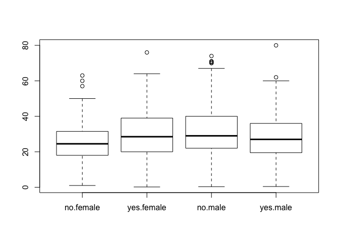

### Contingency tables

In this walk-through, you will learn a few tools for summarizing
categorical data using contingency tables.

Data files:  
\* [TitanicSurvival.csv](TitanicSurvival.csv)

First download the TitanicSurvival.csv file and read it in. You can use
RStudio's Import Dataset button, or the read.csv command:

    TitanicSurvival = read.csv('TitanicSurvival.csv')

Let's look at the first few lines of the data set using the `head`
function.

    head(TitanicSurvival)

    ##                                 X survived    sex     age passengerClass
    ## 1   Allen, Miss. Elisabeth Walton      yes female 29.0000            1st
    ## 2  Allison, Master. Hudson Trevor      yes   male  0.9167            1st
    ## 3    Allison, Miss. Helen Loraine       no female  2.0000            1st
    ## 4 Allison, Mr. Hudson Joshua Crei       no   male 30.0000            1st
    ## 5 Allison, Mrs. Hudson J C (Bessi       no female 25.0000            1st
    ## 6             Anderson, Mr. Harry      yes   male 48.0000            1st

We can see the name of each passenger and whether they survived, along
with their age, sex, and cabin class.

Next, we'll use the xtabs (for cross-tabulate) function to make some
contingency tables. We can stratify by survival status and sex:

    xtabs(~survived + sex, data=TitanicSurvival)

    ##         sex
    ## survived female male
    ##      no     127  682
    ##      yes    339  161

Or by passenger class:

    xtabs(~survived + passengerClass, data=TitanicSurvival)

    ##         passengerClass
    ## survived 1st 2nd 3rd
    ##      no  123 158 528
    ##      yes 200 119 181

We can also turn a table of counts into a table of proportions using the
`prob.table` command.

    table1 = xtabs(~survived + sex, data=TitanicSurvival)
    prop.table(table1, margin=1)

    ##         sex
    ## survived    female      male
    ##      no  0.1569839 0.8430161
    ##      yes 0.6780000 0.3220000

The first command says to store the table of raw counts in a variable
called `table1`. The second says to turn the counts into proportions,
standardizing along the rows (margin=1).

We can also standardize along the columns, which probably makes more
sense here. We're thinking of sex as the predictor and survival as the
response, and therefore we want to see how the relative chances of
survival changes for men versus women:

    prop.table(table1, margin=1)

    ##         sex
    ## survived    female      male
    ##      no  0.1569839 0.8430161
    ##      yes 0.6780000 0.3220000

From the table, we can read off the odds of survival for both men and
women. Let's store these in new variables:

    odds_male = 0.19/0.81
    odds_female = 0.73/0.27

Now we can use these to compute the odds ratio, a standard measure of
association in two-by-two contingency tables.

    odds_ratio = odds_female/odds_male
    odds_ratio

    ## [1] 11.52632

An odds ratio of about 12 quantifies the extent to which females were
more likely to survive than males.

We can also look at survival stratified by two variables.

    xtabs(~survived + sex + passengerClass, data=TitanicSurvival)

    ## , , passengerClass = 1st
    ## 
    ##         sex
    ## survived female male
    ##      no       5  118
    ##      yes    139   61
    ## 
    ## , , passengerClass = 2nd
    ## 
    ##         sex
    ## survived female male
    ##      no      12  146
    ##      yes     94   25
    ## 
    ## , , passengerClass = 3rd
    ## 
    ##         sex
    ## survived female male
    ##      no     110  418
    ##      yes    106   75

We can also see whether age seems correlated with survival:

    boxplot(age~survived:sex, data=TitanicSurvival)

The colon between survived and sex refers to an interaction. It says to
give separate boxplots for every pairwise combination of these two
variables.
